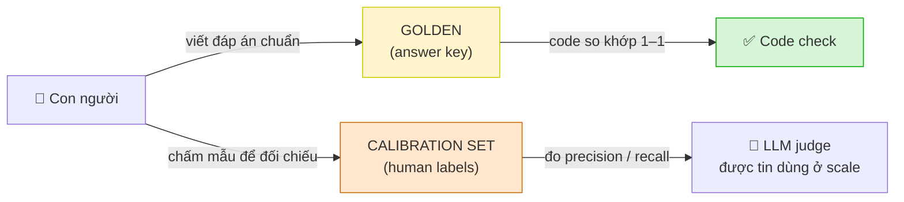
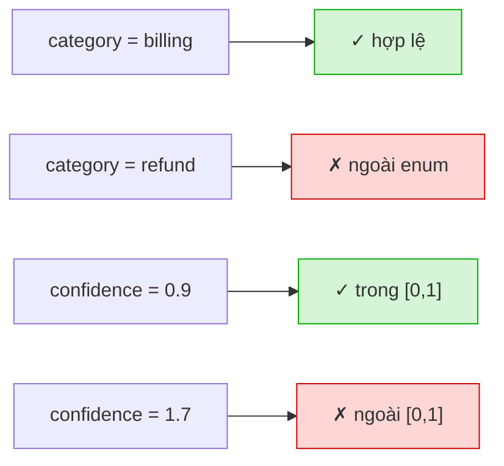
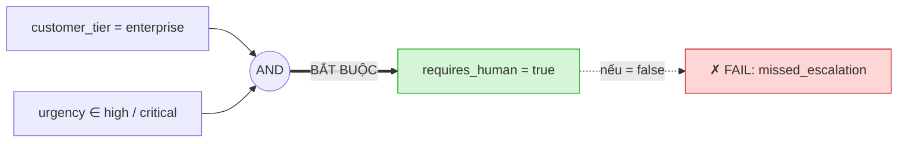
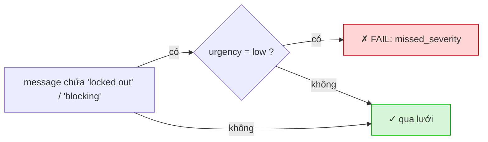
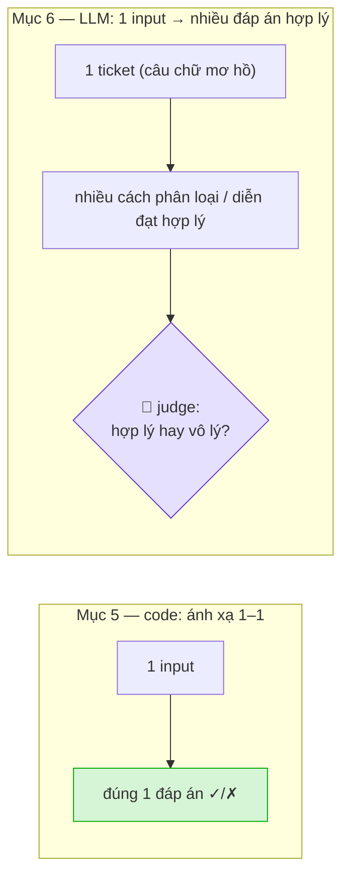
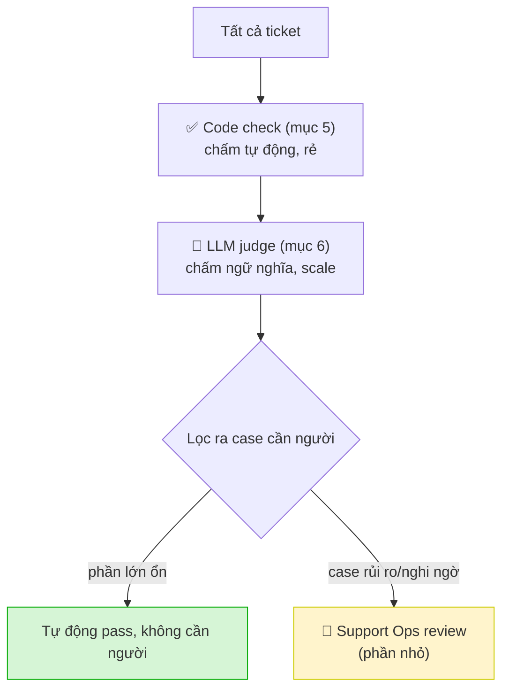

# Case 1 — Support Ticket Triage — Workbook (Bài làm)

> Học viên: Nguyễn Đăng Huy — 2A202600641
> Mỗi quyết định đều kèm **lý do**. UI/workflow sketch bằng ASCII. Giá API dùng giá thật của Anthropic (tháng 6/2026).

---

## 1. Unit of Work

**Quyết định:** Một ticket support đi vào → AI đọc `subject`, `message`, `customer_tier` → sinh một bộ nhãn triage: `category`, `urgency`, `requires_human`, `route_to`, `reason`. Output **không** gửi cho khách; nó được inbox/queue nội bộ dùng để xếp ticket vào đúng hàng xử lý và quyết định có escalate không.

**Lý do đây là đơn vị đủ nhỏ để eval:**
- Có ranh giới rõ: *một ticket vào → một bộ nhãn ra*, nên chấm được từng ticket độc lập, không bị trộn lẫn với phần việc của con người hay các bước sau.
- Nhưng vẫn chạm đúng rủi ro vận hành: nếu nhãn sai thì ticket đi sai team, trễ SLA, hoặc bỏ sót escalation cho khách enterprise.
- Mình **không** chọn "toàn bộ hệ thống hỗ trợ khách hàng" vì lát cắt đó gộp cả người, tool và nhiều bước → không rõ đang đo cái gì.

---

## 2. Quality Question

**Câu hỏi chất lượng:** Với mỗi ticket, AI có (a) phân đúng `category` và `route_to` để ticket vào đúng team, và (b) bật `requires_human`/escalation đúng lúc khi khách enterprise + có tín hiệu blocking, **mà không bịa thông tin ngoài ticket**, hay không?

**Vì sao fail ở đây là nghiêm trọng:**
- Ticket billing bị route sang `product_team` → trễ xử lý vấn đề tiền bạc (lỗi **P1 — sai route**).
- Enterprise đang "locked out / blocking work" nhưng `urgency=medium, requires_human=false` → **bỏ sót escalation** (lỗi **P0/P1**), khách mất trust và có thể vỡ SLA.
- `reason` bịa thêm fact không có trong ticket → nhân viên tin nhầm, xử lý sai hướng.

Hành vi **bắt buộc**: escalate khi enterprise + urgency cao. Hành vi **bị cấm**: bịa fact, đánh `low` cho ticket có dấu hiệu blocking.

---

## 3. Output Contract tối thiểu

Suy ngược từ UI + mock outcome. Chỉ giữ field nào làm thay đổi **màn hình**, **routing**, **release gate**, hoặc cần cho **eval**.

| Field | Kiểu / giá trị | Vì sao cần giữ |
| --- | --- | --- |
| `ticket_id` | string | Join trace, render đúng ticket trên UI, dùng làm khóa khi chạy eval/regression. |
| `category` | enum: `technical / billing / feature_request / unknown` | Quyết định team xử lý + nhãn hiển thị trên UI. Có `unknown` để xử lý case thiếu thông tin (không ép đoán bừa). |
| `urgency` | enum: `low / medium / high / critical` | Quyết định queue ưu tiên + là điều kiện trong release gate (escalation recall). |
| `requires_human` | boolean | Cờ "cần xử lý ngay" trên UI + trigger escalation. Là field high-risk nhất. |
| `route_to` | enum: `technical_support / billing_ops / product_team / human_escalation` | Đích thật ticket được đẩy tới; field này nếu sai là gây hậu quả vận hành rõ nhất. |
| `reason` | string (ngắn) | Hiển thị cho nhân viên hiểu vì sao; là thứ LLM judge chấm "có grounded trong ticket không". |
| `confidence` | number 0–1 | Dùng để route case `confidence` thấp sang human review; code kiểm tra nằm trong `[0,1]`. |

Các field bị loại (vì không đổi UI/route/gate): sentiment chi tiết, độ dài message, timestamp nội bộ… — chưa cần ở version đầu.

---

## 4. Eval Decision Map

| Thành phần cần chấm | Code | LLM | Human | Expert | Lý do |
| --- | :--: | :--: | :--: | :--: | --- |
| Schema + enum hợp lệ (`category/urgency/route_to` đúng tập cho phép) | ✅ | | | | Đúng/sai tuyệt đối, kiểm tra bằng validator — nhanh, ổn định, chạy mọi request. |
| `confidence ∈ [0,1]` | ✅ | | | | Invariant số học, không cần hiểu nghĩa. |
| Rule cứng: `enterprise` + `urgency∈{high,critical}` ⇒ `requires_human=true` | ✅ | | | | Đề đã phát biểu thành rule rõ ràng → assertion deterministic. |
| Rule cứng: ticket `billing` **không** route `product_team` | ✅ | | | | Ràng buộc routing đã cho sẵn, code chặn được chắc chắn. |
| `category` có đúng với **ý thật** của ticket không | | ✅ | ✅ (golden) | | Cần đọc hiểu nội dung; code không phân biệt được "product question" vs "billing" khi câu chữ mơ hồ. Human tạo golden để calibrate LLM. |
| `reason` có **grounded** trong ticket, không bịa fact | | ✅ | ✅ (calib) | | Phát hiện hallucination là việc ngữ nghĩa; code không bắt được "thêm sự thật không có". |
| Quyết định escalation trên case **mơ hồ / high-risk** | | | ✅ | | Recall quan trọng hơn precision; lỗi bỏ sót escalation đắt → người duyệt mẫu high-risk + low-confidence. |

**Không cần domain expert** ở case này — xem mục 7.

### Giải nghĩa `golden` và `calib`

- **`golden` (golden label / golden output)** = **đáp án đúng do con người xác nhận** cho một case cụ thể — bản thân "sự thật", không phải dự đoán của AI. Ví dụ với ticket `T-002`, golden là `{category: billing, urgency: critical, requires_human: true, route_to: billing_ops}`. Có golden rồi thì **code** chỉ việc so khớp output của AI với golden (khớp = pass). Không có golden thì không có thước đo nào để chấm → nên con người phải tạo trước.
- **`calib` (calibration / hiệu chuẩn)** = bước **kiểm tra chính người chấm tự động (LLM judge) trước khi tin nó ở quy mô lớn**.
  - *Ví von:* trước khi để một trợ giảng mới chấm 1.000 bài một mình, ta đưa họ 40 bài mà giáo viên chính **đã chấm sẵn** và xem họ trùng khớp tới đâu. Ở đây "trợ giảng" = LLM judge, "giáo viên chính" = con người, "bài thi" = các output AI cần chấm (vd: `reason` có bịa fact không).
  - Không thể tin judge mù quáng vì judge cũng là một model có thể sai.

  **Ví dụ cụ thể (check `reason` có bịa fact không):** lấy 40 ticket. Con người đọc và gán nhãn thật: **10 thật sự FAIL** (reason bịa fact), **30 thật sự PASS**. Cho LLM judge chấm lại 40 ticket đó, rồi lập bảng đối chiếu:

  | | Người nói FAIL | Người nói PASS |
  | --- | :--: | :--: |
  | **Judge nói FAIL** | 9 ✅ (bắt đúng) | 3 ❌ (báo động giả) |
  | **Judge nói PASS** | 1 ❌ (bỏ sót!) | 27 ✅ (trùng) |

  - **Recall = 9 / (9+1) = 0.90** → trong 10 lỗi thật, judge bắt được 9. *(Bắt được bao nhiêu % lỗi thật?)*
  - **Precision = 9 / (9+3) = 0.75** → khi judge la "FAIL" thì đúng 75%. *(Phán quyết "fail" đáng tin tới đâu?)*

  **Vì sao không chỉ nhìn "tỉ lệ trùng khớp"?** Nếu 95% case là pass, một judge lười *luôn đoán pass* vẫn trùng 95% — mà bắt được **0** lỗi thật. Nên phải đo recall/precision, không phải % trùng.

  **Ra quyết định:** recall 0.90 là tốt (mục tiêu là *bắt được* lỗi) → tin judge để chấm đại trà; precision 0.75 (cứ 4 lần "fail" có 1 báo nhầm) chấp nhận được *vì mọi case judge nói "fail" đều được đẩy cho người xem lại* nên báo nhầm chỉ tốn 1 lượt liếc mắt, không gây release sai. Nếu recall chỉ 0.50 (bỏ sót nửa số lỗi) thì **không** tin judge cho release gate, giữ người chấm. Bước này phải **audit định kỳ** vì judge có thể lệch chuẩn theo thời gian.



> Nguyên tắc gốc: **Con người định nghĩa cái đúng (golden). LLM scale cái đã được con người định nghĩa và kiểm định (calibration).** Vì vậy trong bảng trên: `✅ (golden)` = người viết đáp án chuẩn để code so khớp; `✅ (calib)` = người chấm một bộ mẫu để kiểm định LLM judge trước khi tin.

---

## 5. Kiểm tra tự động bằng code

Nguyên tắc: chỉ đưa vào đây thứ quyết định được pass/fail **bằng rule, không cần hiểu nghĩa ticket**. Chia 3 nhóm: cấu trúc, rule nghiệp vụ đã phát biểu, và lưới an toàn/recall.

Mỗi nhóm có **một dạng quyết định** khác nhau — sơ đồ nhỏ dưới đây cho thấy vì sao cả ba đều giao được cho code.

### Nhóm cấu trúc — *bản chất: ánh xạ 1–1 (mỗi giá trị → đúng một phán quyết)*



> Mỗi giá trị ứng với **đúng một** kết quả ✓/✗, không có vùng xám, không cần hiểu nghĩa ticket → đây chính là thứ code làm tốt nhất.

- Kiểm tra: Output là JSON hợp lệ và có đủ field bắt buộc (`ticket_id, category, urgency, requires_human, route_to, reason, confidence`).
  Vì sao nên giao cho code: vỡ schema thì không render/route được — đúng/sai tuyệt đối, validator chạy mọi request.
- Kiểm tra: `category ∈ {technical, billing, feature_request, unknown}`; `urgency ∈ {low, medium, high, critical}`; `route_to ∈ {technical_support, billing_ops, product_team, human_escalation}`.
  Vì sao nên giao cho code: enum đóng, so khớp tập hợp là deterministic.
- Kiểm tra: `confidence` là số và `∈ [0,1]`.
  Vì sao nên giao cho code: invariant số học, không cần ngữ nghĩa.

### Nhóm rule nghiệp vụ — *bản chất: mệnh đề kéo theo (IF điều kiện ⇒ output BẮT BUỘC = giá trị cố định)*



> Rule = logic: điều kiện đúng thì output **bắt buộc** mang một giá trị định trước. Kiểm tra một mệnh đề logic là việc thuần code, không phải phán đoán.

- Kiểm tra: nếu `customer_tier=enterprise` và `urgency ∈ {high, critical}` thì `requires_human=true`.
  Vì sao nên giao cho code: rule cứng đã cho; fail = bỏ sót escalation cho enterprise (P0/P1).
- Kiểm tra: nếu `requires_human=true` thì `urgency` không được `low`/null (ticket đã escalate phải có mức khẩn).
  Vì sao nên giao cho code: ràng buộc nội tại giữa hai field, không cần hiểu nội dung.
- Kiểm tra: ticket `category=billing` thì `route_to ≠ product_team`.
  Vì sao nên giao cho code: ràng buộc routing đã cho; fail = ticket đi sai hàng xử lý.
- Kiểm tra: `route_to` nhất quán với `category` theo bảng ánh xạ (billing→billing_ops, technical→technical_support, …).
  Vì sao nên giao cho code: mapping cố định, kiểm tra bằng lookup table.

### Nhóm lưới an toàn / recall / regression — *bản chất: tripwire một chiều (chỉ chặn khi pattern xuất hiện mà output mâu thuẫn)*



> Lưới chỉ "bật" khi có tín hiệu nguy hiểm mà output lại xem nhẹ. Thô và rẻ — cố tình chỉ bắt lỗi hiển nhiên; bản tinh tế (hiểu ngữ cảnh thật) để LLM lo ở mục 6.

- Kiểm tra (tripwire từ khóa): nếu `message` chứa "locked out" / "account disabled" / "blocking work" thì `urgency` không được `low`.
  Vì sao nên giao cho code: đây là lưới recall thô, rẻ; bản tinh tế (hiểu ngữ cảnh) để cho LLM ở mục 6 — lớp code chỉ chặn lỗi hiển nhiên.
- Kiểm tra: `reason` không lộ UUID/email/internal ID/PII (regex).
  Vì sao nên giao cho code: pattern matching xác định, là hard safety rule.
- Kiểm tra (regression): mọi case từng pass trong reference dataset không được fail sau khi đổi prompt/model.
  Vì sao nên giao cho code: so sánh với baseline trong CI, deterministic.
- Kiểm tra: so khớp `category`/`route_to` với **golden label** trên reference case (chỉ áp dụng cho case đã có nhãn chuẩn).
  Vì sao nên giao cho code: khi đã có golden, so khớp là deterministic. *(Lưu ý: quyết định nhãn đúng trên input mới là việc của LLM/human — code không tự bịa golden ở runtime.)*

---

## 6. Tiêu chí chấm bằng LLM

Đây là phần ngược với mục 5. Code chấm được khi *một input → đúng một đáp án*. LLM cần vào cuộc khi *một input có nhiều đáp án chấp nhận được* và phải **đọc hiểu nghĩa** để phán "hợp lý hay vô lý".



Chỉ giữ tiêu chí cần **đọc hiểu ý khách** hoặc **mức độ hợp lý của lý do** — thứ code không bắt được. Mỗi tiêu chí dùng rubric rõ và đã **calibrate** với người (mục 4) trước khi tin ở scale.

- **Tiêu chí:** `category` có khớp với **ý thật** của ticket không (vd: khách than "bị tính tiền 2 lần" phải là `billing`, không phải `feature_request`).
  Vì sao code không bắt tốt: cùng một vấn đề có thể diễn đạt nhiều kiểu; code chỉ kiểm tra `category` *thuộc enum*, không hiểu được câu chữ thực sự đang nói về cái gì. Cần đọc hiểu intent.

- **Tiêu chí:** `reason` có **grounded** trong ticket không — chỉ dựa trên dữ kiện có trong input, **không bịa thêm** ("account history", lý do không tồn tại).
  Vì sao code không bắt tốt: phát hiện "thêm một sự thật không có trong ticket" là việc đối chiếu ngữ nghĩa giữa reason và nội dung; regex/keyword không phân biệt được fact thật với fact bịa.

- **Tiêu chí:** mức `urgency` có **hợp lý với mức nghiêm trọng thực** của ticket không (giọng khách, tác động: blocking công việc, mất tiền, mất truy cập).
  Vì sao code không bắt tốt: "nghiêm trọng tới đâu" là phán đoán theo ngữ cảnh; code chỉ bắt được vài từ khóa thô (mục 5), không đánh giá được mức độ tổng thể.

- **Tiêu chí:** ticket **mơ hồ / thiếu thông tin** ("Help", "please help asap") → AI nên trả `category=unknown` hoặc hướng cần làm rõ, **không tự tin gán nhãn mạnh**.
  Vì sao code không bắt tốt: phân biệt "đủ tín hiệu để phân loại" với "chưa đủ, cần hỏi thêm" là đánh giá độ chắc chắn ngữ nghĩa; code không biết khi nào dữ liệu là "quá ít".

- **Tiêu chí:** ticket **đa intent** (vừa hỏi billing vừa xin tính năng) → AI giữ được **intent chính** và không đánh rơi intent phụ.
  Vì sao code không bắt tốt: tách và xếp ưu tiên nhiều ý trong một đoạn văn cần hiểu nghĩa; code không nhận ra có mấy intent.

- **Tiêu chí:** `reason` có **đúng trọng tâm** không — nêu đúng vấn đề chính khách đang gặp, không lạc sang chi tiết phụ.
  Vì sao code không bắt tốt: "đúng trọng tâm" là chất lượng diễn đạt/ngữ nghĩa, không có rule cứng để assert.

> Lưu ý vận hành: với case high-risk hoặc khi judge `confidence` thấp / judge và code mâu thuẫn → đẩy sang **human review** (mục 7), không để LLM tự quyết một mình.

---

## 7. Human / Expert Review

Ý chính: **không phải ticket nào cũng cần người xem.** Code + LLM judge chấm phần lớn tự động; con người chỉ xem một **phần nhỏ được chọn lọc** — những case dễ sai và đắt nếu sai.



**Ai xem?** Trong pilot là **trưởng nhóm Support Ops** (người rành: team nào lo billing, thế nào là "blocking work", luật SLA) cùng **PM**. Họ cũng là người viết golden label và calibrate LLM judge.

**Xem case nào?** Không xem hết, cũng không chỉ bốc ngẫu nhiên — chọn lọc theo từng nhóm rủi ro:

| Nhóm case đưa cho người xem | Vì sao chọn nhóm này |
| --- | --- |
| **Ngẫu nhiên** một ít | đo sức khỏe tổng thể của hệ thống |
| **Rủi ro cao**: enterprise + dính tiền/escalation | đây là chỗ sai thì đắt nhất (bỏ escalation, sai route billing) |
| **Judge không chắc**: `confidence` thấp | để người quyết thay khi máy lưỡng lự |
| **Mâu thuẫn**: code và LLM (hoặc người và LLM) chấm khác nhau | dấu hiệu LLM judge bắt đầu lệch chuẩn |
| **Intent mới** chưa từng gặp | phát hiện loại ticket mới để bổ sung dataset |
| **Regression**: lỗi cũ | kiểm tra lỗi cũ có quay lại sau khi đổi prompt/model không |

Người xem để **xác nhận** ba thứ cần phán đoán: nhãn `category`/`route` chuẩn, quyết định escalation ở case rủi ro cao, và mức nghiêm trọng của lỗi mới.

### Có cần domain expert không? → **KHÔNG**

So sánh cho dễ hình dung:

| | Case 1 — Triage | (đối chiếu) Case 3 — Y tế |
| --- | --- | --- |
| Kiến thức để chấm | **vận hành**: team nào lo gì, luật SLA — đội Support đã biết | **chuyên môn có chứng chỉ**: bác sĩ/điều dưỡng mới phán được |
| Sai thì hại gì | ticket trễ / đi sai hàng — **thấy được, sửa được** | có thể **hại sức khỏe bệnh nhân** — khó cứu vãn |
| Ai duyệt là đủ | Support Ops + monitoring | **bắt buộc** có domain expert |

Vì hậu quả tệ nhất ở Case 1 chỉ là **chậm/sai luồng nội bộ** (hiển thị được, khắc phục được), nên **human review từ Support Ops + online monitoring là đủ** — không cần chuyên gia chuyên ngành ngồi trong vòng duyệt.

### 7A. Màn hình cho Domain Expert (ASCII)

`Không áp dụng` — case này không dùng domain expert nên không cần màn hình review riêng cho expert.

### 7B. Tiêu chí review của Domain Expert

`Không áp dụng` — vì chất lượng triage được xác nhận bởi human review vận hành (Support Ops), không cần bộ tiêu chí chuyên môn của domain expert.

---

## Dataset Edge Cases (5 case)

5 ticket chọn lọc, mỗi case bắt một loại failure khác nhau (không phải dataset lớn).

1. **Happy path** — Enterprise nhắn "reset mật khẩu 2 lần vẫn không vào được, đang bị chặn việc".
   Kỳ vọng: `technical`, `urgency=high`, `requires_human=true`, route `technical_support`.
   *Bắt lỗi gì:* đảm bảo hành vi cốt lõi vẫn đúng — nếu case rõ ràng này mà sai thì hệ thống hỏng nền tảng.

2. **Ambiguous input** — "Chị ơi bên em xử lý giúp cái này với, gấp lắm" (không có tín hiệu loại vấn đề).
   Kỳ vọng: `category=unknown` hoặc hướng cần làm rõ, **không** tự tin gán nhãn mạnh.
   *Bắt lỗi gì:* over-confident classification / bịa category khi câu chữ mơ hồ.

3. **Missing information** — `subject="Help"`, `message="please help asap"`.
   Kỳ vọng: `unknown`, `confidence` thấp, đề xuất hỏi thêm.
   *Bắt lỗi gì:* AI gán nhãn mạnh dù **thiếu dữ liệu** — bắt hallucination từ input nghèo.

4. **High-risk / escalation** — Enterprise: "URGENT: payment failed and account disabled" (giống `T-002`).
   Kỳ vọng: `billing`, `urgency=critical`, `requires_human=true`, route `billing_ops`/`human_escalation`.
   *Bắt lỗi gì:* **bỏ sót escalation + sai route tiền bạc** — đúng lỗi P0/P1 mà mock outcome `T-002` mắc phải.

5. **Regression** — Ticket "tôi bị tính tiền 2 lần" từng bị model cũ gán `feature_request`, nay phải là `billing`.
   Kỳ vọng: `billing`, route `billing_ops`; case này được khóa làm golden.
   *Bắt lỗi gì:* lỗi cũ quay lại sau khi đổi prompt/model (nondeterministic regression).

> 5 case này phủ: match rõ (1), thiếu tín hiệu/ambiguity (2,3), escalation high-risk (4), regression (5) — đúng các lát cắt brief yêu cầu.

---

## 8. Release Gate

Quy tắc: thứ **gây hại trực tiếp** thì chặn ship (`block_if`); thứ chỉ **xấu dần** thì cảnh báo (`warn_if`). Ngưỡng bám theo failure mode + severity ở các mục trên.

```yaml
release_gate:
  block_if:                          # chặn ship nếu vi phạm
    - p0_failures > 0                # bỏ escalation enterprise high-risk, hoặc lộ PII
    - schema_pass_rate < 0.995       # vỡ contract → không render/route được
    - enterprise_escalation_recall < 0.95   # phải bắt gần hết case enterprise cần escalate
    - billing_misroute_count > 0     # billing đi sai team là lỗi tiền bạc, không cho qua
    - category_accuracy < 0.90       # so với golden trên reference set
    - p1_failures > baseline_p1      # số lỗi P1 không được tệ hơn bản trước
  warn_if:                           # không chặn, nhưng phải review
    - avg_latency_ms > baseline * 1.2
    - avg_cost_usd > baseline * 1.15
    - llm_judge_disagreement_rate > 0.10   # judge bắt đầu lệch chuẩn → cần calibrate lại
```

**Khi nào một case bắt buộc qua human review (không để máy tự quyết):**
- `confidence` của judge < 0.75, hoặc
- code và LLM judge chấm mâu thuẫn, hoặc
- ticket enterprise + high-risk (tiền/escalation), hoặc
- user thumbs-down / mở lại ticket, hoặc
- xuất hiện failure mode mới.

**Vì sao các ngưỡng này có nghĩa vận hành:** `escalation_recall` được ưu tiên (recall > precision) vì bỏ sót escalation đắt hơn báo nhầm; `billing_misroute = 0` vì là lỗi tiền; `schema_pass ≥ 0.995` vì vỡ schema làm sập cả luồng render/route. Đây là những lỗi mà nếu lọt ra production sẽ thấy ngay ở SLA và mức hài lòng của khách enterprise.

---

## 9. Kế hoạch chạy thử và dự toán chi phí

Tách 2 phần: **tiền máy** (API, tính từ giá thật) và **tiền người** (giờ công). Mọi con số kèm giả định.

### Quy mô pilot (lấy mốc README: 50–100 cases, 30–50 vòng)
- **80 cases** trong reference dataset · **40 vòng** chạy/lặp (khi đổi prompt/model).
- ⇒ **3.200 lần gọi triage** + **3.200 lần gọi LLM judge**.

### Giá API thật
Bảng giá Anthropic — **Claude Sonnet 4.6 = $3 / 1M token input, $15 / 1M token output**. Dùng Sonnet 4.6 cho cả agent triage và LLM judge (đủ tốt cho phân loại + chấm ngữ nghĩa, rẻ hơn Opus 4.8).

### Ước lượng token (giả định)
| | Input/lần | Output/lần |
| --- | --- | --- |
| Triage | ~1.200 tok (system+enum+ví dụ ~800, ticket ~400) | ~250 tok |
| Judge | ~1.400 tok (rubric ~700 + ticket ~400 + output ~250) | ~200 tok |

### Chi phí API
| Khoản | Token | × giá | Thành tiền |
| --- | --- | --- | --- |
| Triage input | 3.200 × 1.200 = 3,84M | × $3 | $11,5 |
| Triage output | 3.200 × 250 = 0,80M | × $15 | $12,0 |
| Judge input | 3.200 × 1.400 = 4,48M | × $3 | $13,4 |
| Judge output | 3.200 × 200 = 0,64M | × $15 | $9,6 |
| **Tổng API** | | | **≈ $47 → làm tròn ~$60** (đệm retry/dev) |

### Giờ công (không có domain expert)
| Vai trò | Giờ | Làm gì |
| --- | --- | --- |
| PM / eval design | ~20h | Quality Question, output contract, decision map, rubric judge, release gate |
| Eng / vận hành | ~30h | eval runner, code assertions, nối dataset, chạy 40 vòng, dashboard |
| Human review (Support Ops) | ~25h | tạo golden 80 case, calibrate judge ~40 case, duyệt mẫu high-risk/fail |
| Domain expert | **0h** | không cần (mục 7) |
| **Tổng** | **~75h** | |

Giả định đơn giá blend ~**$20/h** (~500k VND/h) ⇒ tiền người ~**$1.500**.

### Tổng kết
- **Tổng chi phí pilot ≈ $1.560** ($1.500 người + $60 máy).
- **Tổng thời gian ≈ 2–3 tuần** (T1: dataset + golden + code asserts; T2: chạy vòng + calibrate judge + review; T3 đệm: phân tích + gate + báo cáo).

**4 câu chốt:**
1. Giá API lấy từ **bảng giá thật của Anthropic** (Sonnet 4.6 $3/$15 mỗi 1M token).
2. Với quy mô 80 case × 40 vòng, tổng chi phí rơi vào **~$1.500–1.700**, trong đó **tiền máy chỉ ~$60** — phần lớn là giờ công người.
3. Plan đủ để chứng minh hướng làm vì nó đo được `category_accuracy`, `escalation_recall`, `schema_pass_rate` trên dataset có golden + judge đã calibrate + release gate có ý nghĩa.
4. Nhờ đó trả lời được 3 câu hỏi PM: *hiện chính xác tới đâu, đã đủ an toàn để đề xuất tiếp chưa, và với budget nhỏ team chứng minh được gì* — tất cả với chi phí rất thấp và thời gian ~3 tuần.


